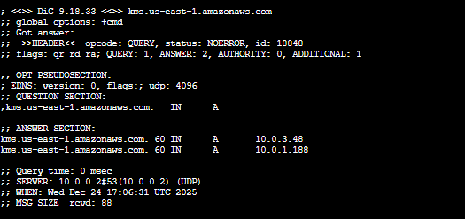

# Arquitectura de Red Empresarial en AWS — De la comprensión manual a la automatización con IaC 🚀


## 1️⃣ Historia del Proyecto

En Cloud es muy fácil ejecutar una plantilla y ver cómo los recursos se crean automáticamente.  
Sin embargo, como **Ingeniera Cloud**, tengo una regla clara:

> **“No automatizar nada que primero no se entienda.”**

Este proyecto nace precisamente de esa filosofía. Antes de llevar la infraestructura a código, construí **toda la red manualmente**, paso a paso, desde la consola de AWS, entendiendo cómo fluye el tráfico, cómo se aplican las reglas de seguridad y cómo cada decisión impacta en la arquitectura completa.

El proyecto se desarrolló en dos fases bien definidas:

### 🔍 Fase 1: Manual Deep Dive
Construcción completa de la arquitectura de red desde la consola de AWS:
* - Creación de la VPC
* - Diseño de subredes públicas y privadas
* - Control del tráfico a nivel de subred con Network ACLs 
* - Configuración de tablas de ruteo
* - Implementación de NAT Gateway
* -  Lanzar instancias EC2
* - Pruebas reales de conectividad

**🎯 Objetivo:**
Comprender el flujo real de los paquetes de red y visualizar la seguridad por capas antes de automatizar.

### ⚙️ Fase 2: IaC Automation (Scale Up)
Una vez dominados los fundamentos, toda la arquitectura fue traducida a **AWS CloudFormation**, logrando:
* - Despliegues reproducibles
* - Eliminación de errores manuales
* - Reducción del tiempo de despliegue de ~45 minutos a ~3 minutos

---

## 2️⃣ Arquitectura Desplegada

La plantilla `template.yaml` aprovisiona una **arquitectura VPC de alta disponibilidad**, diseñada para entornos de producción seguros:

* **VPC Segmentada:** Bloque CIDR `10.0.0.0/16` dividido en zonas.
  
* **Subredes Públicas y Privadas:**
    * *Públicas:* Para balanceadores o Bastion hosts.
    * *Privadas:* Aislamiento total para bases de datos o backends.
      
* **Seguridad Perimetral (NAT Gateway):**
    * Permite a las instancias privadas descargar actualizaciones de internet.
    * Bloquea cualquier intento de conexión entrante desde el exterior.
      
* **Privacidad de Datos (VPC Endpoints):**
    * Implementación de **Gateway Endpoint** para S3.
    * Implementación de **Interface Endpoint** para KMS.
    * *Beneficio:* El tráfico sensible viaja exclusivamente por la red troncal de AWS, nunca toca la internet pública.

---

## 3️⃣ Validación Técnica (Evidence)

Desplegar no es suficiente: la arquitectura fue **probada y validada**.

### ✅ 3.1 Salida segura desde subred privada (NAT Gateway)
Desde una instancia ubicada en una **subnet privada (sin IP pública)** se validó acceso a Internet:


✔ Confirma que el NAT Gateway funciona correctamente  
✔ La instancia permanece completamente aislada del exterior

---

### 🔐 3.2 Validación de VPC Interface Endpoint (KMS)
Resolución DNS del servicio KMS desde una instancia privada:



✔ La respuesta devuelve una IP privada (`10.x.x.x`)  
✔ El tráfico no utiliza Internet público

---

## 4️⃣ Guía de Despliegue (Quick Start)

Si deseas replicar esta infraestructura en tu cuenta AWS:

### 📌 4.1 Preparar el entorno
Abre tu terminal y navega a la carpeta del proyecto:
```bash
PS C:\proyectos-aws\proyect-04-vpc-networking-cfn-iac> 
```
### ☁️ 4.2 Desplegar la infraestructura con CloudFormation
```bash
aws cloudformation deploy --template-file template.yaml --stack-name vpc-networking --capabilities CAPABILITY_IAM
```
## 5️⃣ Test Connectivity (Comandos de Validación)
Una vez desplegada la infraestructura, accedemos a la instancia privada mediante **AWS Systems Manager (SSM)** y ejecutamos las siguientes pruebas para certificar la red:

### 🔹 5.1 Verificar conectividad interna (Ping entre instancias privadas)
```bash
ping 10.0.0.242 -c 5
```

### 🔹 5.2 Confirmar salida a Internet (Validación de NAT Gateway)
Si responde, la instancia privada tiene acceso a internet para actualizaciones.
```bash
ping example.com -c 5
```
### 🔹 5.3 Prueba de latencia hacia IP Pública específica
```bash
ping 52.23.201.228 
```
### 🔹 5.4 Validar VPC Interface Endpoint para KMS
IMPORTANTE: La respuesta debe ser una IP Privada (10.x.x.x), 
confirmando que el tráfico NO sale a la internet pública.
```bash
dig kms.us-east-1.amazonaws.com
```
### 6️⃣ Limpieza de Recursos (Clean Up)
Para eliminar todos los recursos y evitar costos (especialmente del NAT Gateway), ejecuta:
```bash
aws cloudformation delete-stack --stack-name vpc-networking
```
